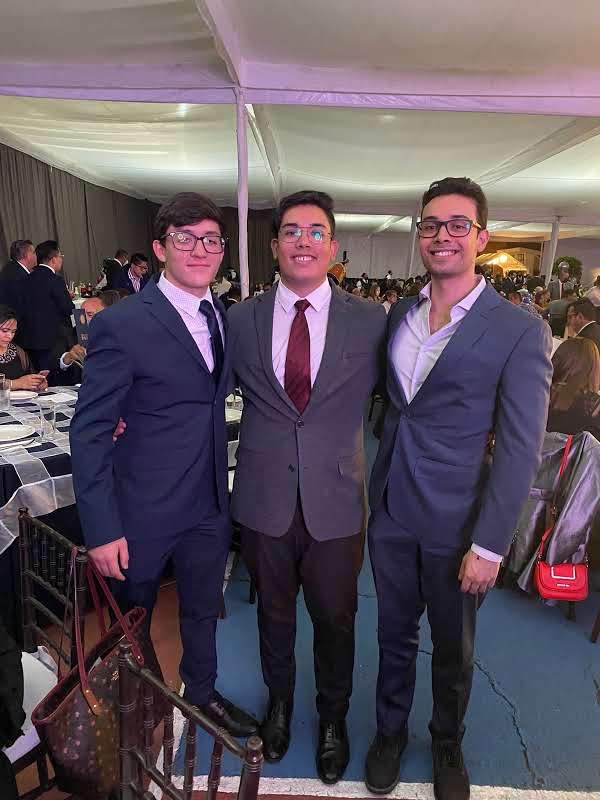
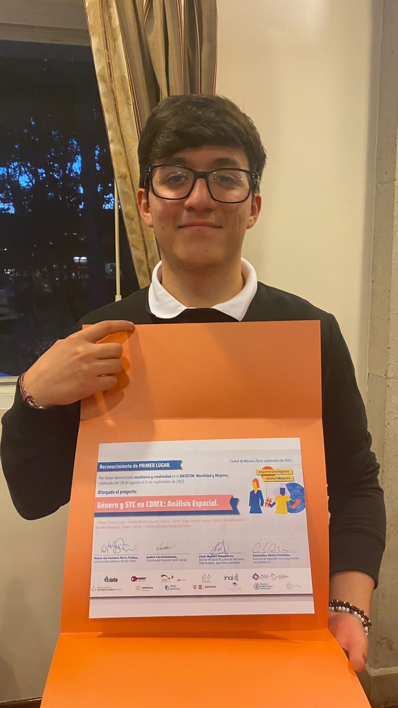

## Itamita por diversión 

## Sobre mí 

  
    Soy estudiante de la Licenciatura en Ciencia de Datos en el Instituto Tecnológico Autónomo de México (ITAM), apasionado por la Inteligencia Artificial y su potencial para crear soluciones que beneficien a las personas. He trabajado en proyectos con enfoque social, logrando dar soluciones a problemas sociales, además de herramientas que ayuden a la vida cotidiana de las personas.
  

  Soy una persona que se enfoca en el desarrollo de habilidades prácticas y comunicación en mí mismo y en los demás; busco evocar en las personas el sentimiento de crecimiento personal y profesional a través de la escucha activa, el trabajo en equipo y la empatía colectiva. 
  

   
  Me impulsa la curiosidad de conocer más allá de lo que los datos nos muestran. 
  

  

  
  La Inteligencia Artificial es una herramienta útil de la tecnología de hoy en día, misma que viene a apoyar en la vida de las personas de forma profesional y personal sin deshumanizar lo que vivir conlleva.
   
  Uno de mis más grandes proyectos a futuro es desarrollar una IA asistente tomando como inspiración a Jarvis o Friday de Tony Stark.
  

## Intereses Profesionales

  🤖 Inteligencia Artificial
  📚 Machine Learning
  🛠️ Desarrollo de Aplicaciones
  📈 Análisis de Datos
  👩‍🏫 Enseñar (STEM, inglés)

## Atributos y Características

  Objetivo
  Analítico
  Resolución de problemas
  Pensamiento Crítico
  Familiar
  Empático 
  Aprendizaje rápido
  Curioso

  

## Hobbies y Pasiones

  🌌 Star Wars
  ⚔️ League of Legends (Top laner)
  🏀 Basketball (GSW)
  🎵 Música (Inspector)
  🎲 Juegos de Mesa (Blood Rage)
  📺 Ver series y películas
  💃 Bailar
  🌟 Aprender
  🧩 Resolver problemas (Acertijos, rompecabezas, etc.)
  📜 Filosofía (Aunque no soy fan de la lectura extensa)

## Soft Skills

  Trabajo en equipo 
  Conciencia Social 
  Comunicación Asertiva 

 

## Idiomas

  🇲🇽 Español (Nativo)
  🇺🇸 Inglés (Profesor)
  🇫🇷 Francés (Aprendiendo)

## Proyectos

  <h3>🚇 MetroFlow - Análisis de Movilidad en el Metro CDMX</h3>
  
• Análisis espacial y herramienta de ayuda para la movilidad en el Metro CDMX

  
• Colaboración en equipo para desarrollo de soluciones de movilidad

  
• <a href="https://github.com/juan-ca6/metroFlow" target="_blank">Ver proyecto en GitHub</a>

  <h3>🏆 Datatón "Movilidad y Mujeres" - 1er Lugar</h3>
  
• Proyecto ganador enfocado en el análisis de movilidad de mujeres en CDMX

  
• Desarrollo de estudio de riesgo y propuestas de mejora

  
• Trabajo en equipo para crear soluciones con impacto social

  

  <h3>💻 Estructuras de Datos Avanzadas</h3>
  
• Implementación de estructuras de datos avanzadas en Java y Python

  
• Ejercicios y ejemplos prácticos del curso

  
• <a href="https://github.com/BraulioLoz/EstDatAvJava" target="_blank">Ver proyecto en GitHub</a>

  <h3>✨ Próximamente más...</h3>

